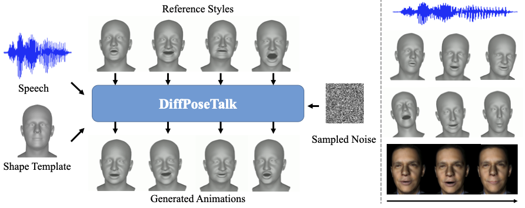

# DiffPoseTalk

<a href='https://arxiv.org/abs/2310.00434/'></a>
<a href='https://raineggplant.github.io/DiffPoseTalk/'></a>
<a href='https://youtu.be/3v_nbMiBY-c/'></a>

DiffPoseTalk: Speech-Driven Stylistic 3D Facial Animation and Head Pose Generation via Diffusion Models



---

We will release the code and dataset after the paper is accepted.

## Citation

```bibtex
@misc{sun2023diffposetalk,
  title={DiffPoseTalk: Speech-Driven Stylistic 3D Facial Animation and Head Pose Generation via Diffusion Models},
  author={Zhiyao Sun and Tian Lv and Sheng Ye and Matthieu Gaetan Lin and Jenny Sheng and Yu-Hui Wen and Minjing Yu and Yong-jin Liu},
  year={2023},
  eprint={2310.00434},
  archivePrefix={arXiv},
  primaryClass={cs.CV}
}
```
